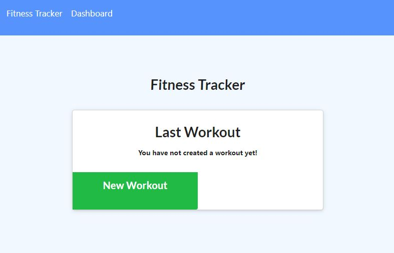
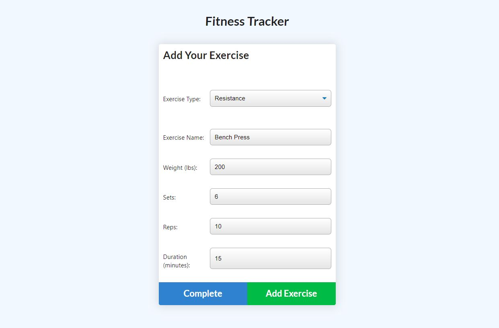
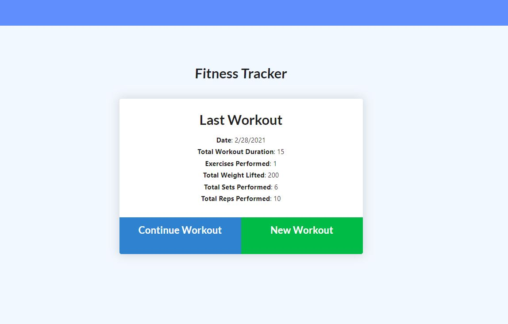

# nosql-fitness-tracker

#### Heroku → <https://alane019.github.io/nosql-fitness-tracker/>
 
[//]: # (markdown comment:  https://alane019.github.io/nosql-fitness-tracker/)

Workout tracking web application using Node.js, MongoDB, and Mongoose. 

  
      
    

  

## License
[MIT](https://choosealicense.com/licenses/mit/)
